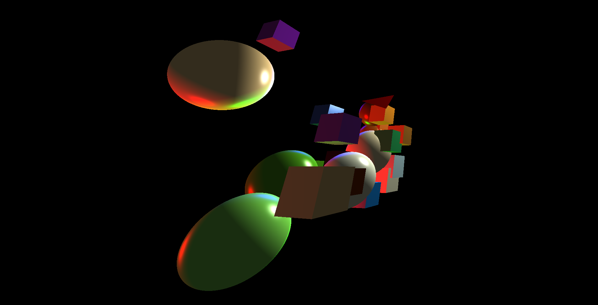
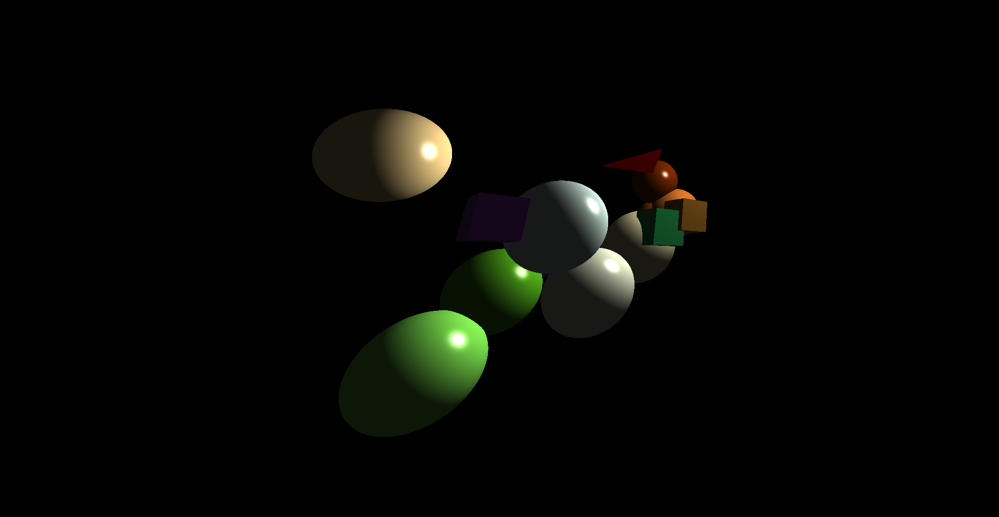
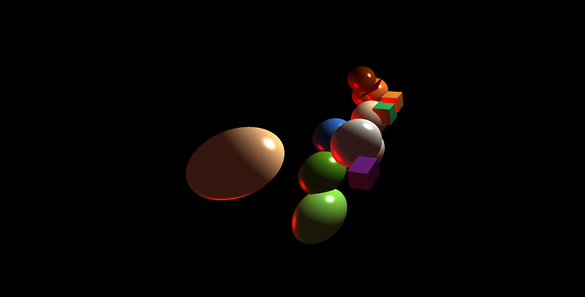
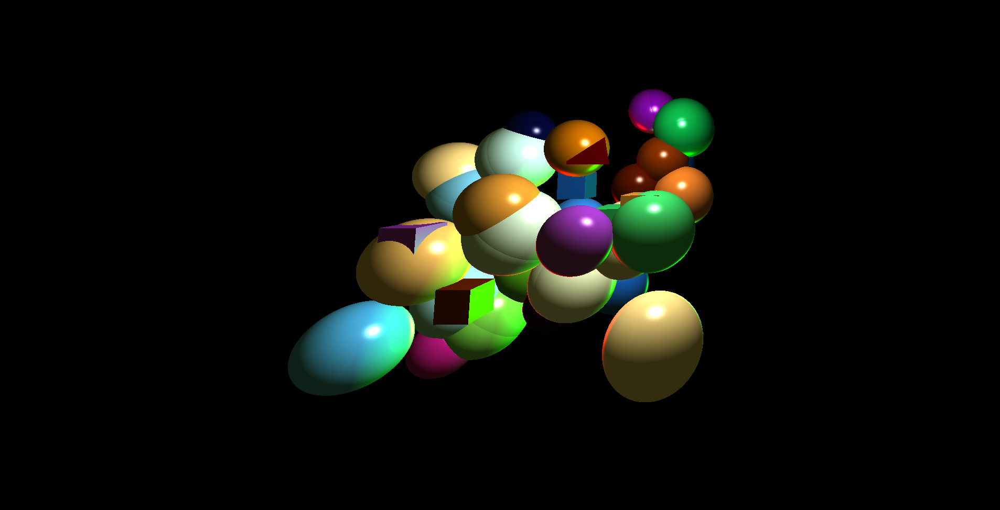

# Project: Concurent real time GPU Raytracer
Authors (team): [Bykov Danylo](https://github.com/DanyaBykov), [Ivan Shevchuk](https://github.com/DoktorTomato)

Mentor: [Ostap Trush](https://github.com/Adeon18)

## Prerequisites

- OpenGL (at least 3.3)
- CMake
- Make
- g++
- GLFW
- GLAD
(GLFW and GLAD are inlcuded in the project but be aware)

### Compilation (Availble for Windows and MacOS)

1. cd raytraycer
2. mkdir build
3. cd build
4. cmake ..
5. make (or alternatively cmake --build .)

TODO: Add Linux support

### Usage

In the build folder run executable compiled earlier.
1. cd build
2. ./raytracer

### Important!

MIGHT NOT COMPILE ON WINDOWS!!!
For windows testing Visual Studio was used which makes the process of compilation and running very simple. Our project should work on Windows but there might be some issues. Everythong will be fixed later.

### Results

After running the raytracer you will see a window opened in which some figures will be traced. You can move and look around in this space using your mouse and WASD buttons on your keyboard.
You can also change amount of objects in space by changing values of variables (amountOfSpheres, amountOfCubes, amountOfLights) in raytracer_fragment.fs.

Here are some screenshots in the program:

